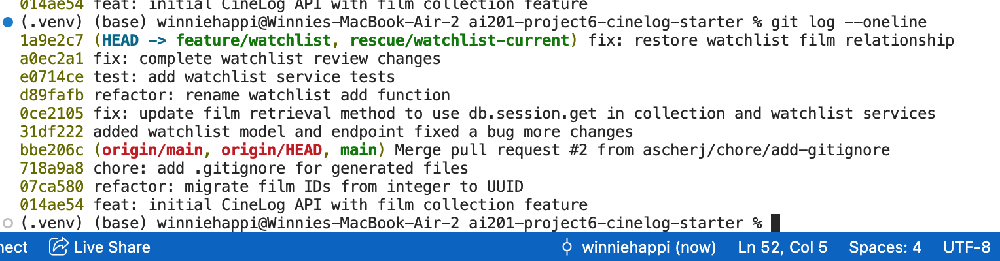

# PR Response Doc — CineLog Watchlist Feature

## AI Usage

I used ChatGPT as an orientation and debugging tool throughout this project. It helped me understand the existing codebase, compare the watchlist implementation with the collection feature, explain the review comments, troubleshoot merge conflicts during the rebase, and verify that my changes followed the project's coding patterns. I verified all suggested changes by running the project's test suite and ensuring the implementation matched the existing codebase.

---

## Comment 1 – Rename

**What I did:**

I renamed `save_to_watchlist()` to `add_to_watchlist()` in `services/watchlist_service.py` so the function follows CineLog’s existing `verb_to_noun` naming convention, consistent with `add_to_collection()`. I also updated the import and function call in `routes/watchlist/watchlist.py`.

**How I verified:**

I used a project-wide search in VS Code for `save_to_watchlist` to confirm that no old references remained. I then ran the full test suite with `pytest tests/ -v` and confirmed the application imported correctly and all tests passed.

---

## Comment 2 – Deduplication

**What I did:**

I followed the pattern used by `add_to_collection()` in `services/collection_service.py`. Before creating a new `WatchlistEntry`, `add_to_watchlist()` now queries for an existing entry with the same `user_id` and `film_id`. If one already exists, the service raises `AlreadyInWatchlistError` instead of creating another row.

I also added a database-level unique constraint on `(user_id, film_id)` so duplicate watchlist records are prevented even if the service-layer validation is bypassed.

**How I verified:**

I added a test that calls `add_to_watchlist()` twice with the same user and film. The test verifies that the second call raises `AlreadyInWatchlistError` and confirms that only one matching `WatchlistEntry` remains in the database. I then ran `pytest tests/ -v`.

---

## Comment 3 – Missing Test

**What I did:**

I created `tests/test_watchlist.py` and used `test_add_to_collection_nonexistent_film_raises()` from `tests/test_collection.py` as the model. The watchlist test passes a film UUID that does not exist and verifies that `add_to_watchlist()` raises `FilmNotFoundError`.

**How I verified:**

I first ran `pytest tests/test_watchlist.py -v` to verify the new watchlist test directly. I then ran `pytest tests/ -v` to confirm that the complete test suite still passed.

---

## Comment 4 – Default Visibility

**My position:**

I changed the default value of `public` from `True` to `False`.

**Reasoning:**

A user's watchlist is personal by default. Making watchlists private unless users intentionally choose to share them better protects user privacy and avoids accidentally exposing personal preferences.

**Tradeoff acknowledged:**

Using a private default requires users to explicitly enable sharing if they want a public watchlist. This adds one extra step for users who prefer sharing but provides safer default behavior.

---

## Comment 5 – Sort Order

**My position:**

I changed the default ordering to sort by `date_added` in descending order instead of alphabetically.

**Reasoning:**

Displaying the most recently added films first makes it easier for users to continue tracking what they recently saved and matches the behavior already used in the collection feature.

**Engagement with reviewer's point:**

I agreed with the reviewer's recommendation because chronological ordering better supports the primary use case of a watchlist than alphabetical ordering.

---

## Comment 6 – Rebase

**What conflicted:**

During the rebase, the `main` branch had migrated film IDs from integers to UUIDs while my watchlist branch still used integer IDs. There were also merge conflicts in `models.py` and `.gitignore`.

**How I resolved it:**

I rebased my branch onto `main`, updated the watchlist model and service to use UUID film IDs, resolved the merge conflicts, removed leftover conflict markers, and kept the new relationships and constraints consistent with the updated codebase.

**How I verified no conflict remains:**

I completed the rebase successfully and ran the full test suite. All tests passed after resolving the conflicts.

---

## PR Description

### Overview

This pull request adds a watchlist feature that allows users to save films they want to watch later. The implementation includes a new `WatchlistEntry` model, watchlist service functions, REST endpoints, and comprehensive unit tests.

### Design Decisions

- Followed the existing `verb_to_noun` naming convention used throughout the project.
- Prevented duplicate watchlist entries through both service-layer validation and a database uniqueness constraint.
- Defaulted watchlists to private for better user privacy.
- Returned watchlist entries ordered by the most recently added films.
- Updated the implementation to use UUID film IDs after rebasing onto the latest `main` branch.

### Manual Testing

- Added a film to a watchlist.
- Attempted to add the same film twice and verified the duplicate was rejected.
- Attempted to add a nonexistent film and verified `FilmNotFoundError` was raised.
- Retrieved a watchlist and confirmed entries were ordered by newest first.
- Ran the complete test suite and confirmed all tests passed.

## AI Usage

I used ChatGPT as an orientation and debugging tool throughout this project. It helped me understand the existing codebase, compare the watchlist implementation with the collection feature, explain the review comments, troubleshoot merge conflicts during the rebase, and verify that my changes followed the project's coding patterns. I verified all suggested changes by running the project's test suite and ensuring the implementation matched the existing codebase.

I also used ChatGPT to review my written responses for Comments 4 and 5 by asking what counterarguments a reviewer might raise. This helped me make sure I acknowledged the tradeoffs of each design decision rather than only explaining my preferred approach.
---

## Git Commit History

Below is the final commit history showing the cleaned-up commit sequence with conventional commit messages.

